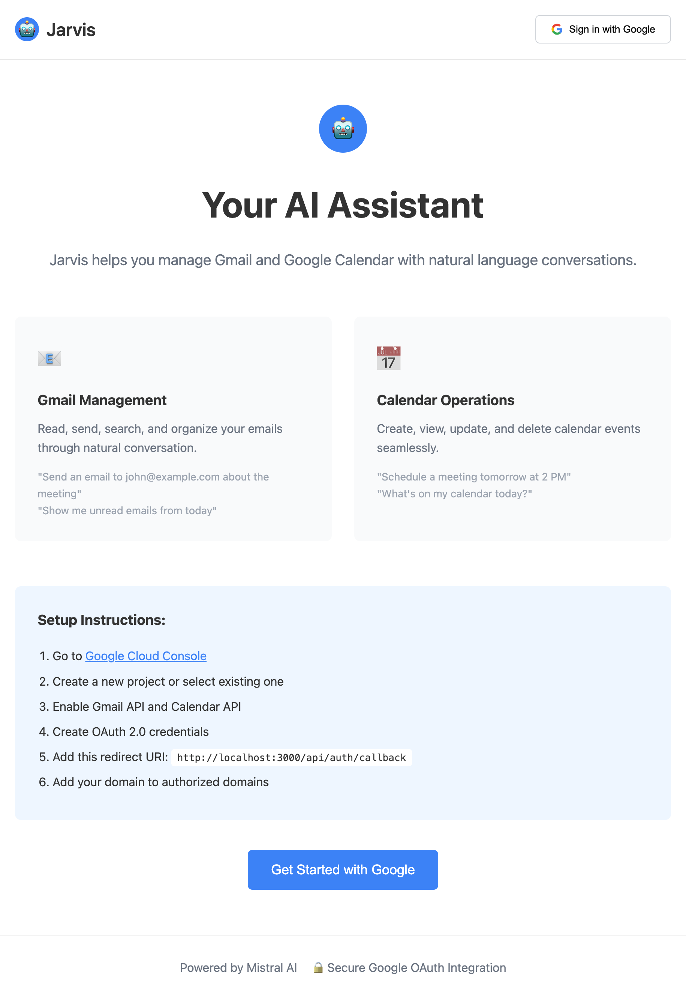
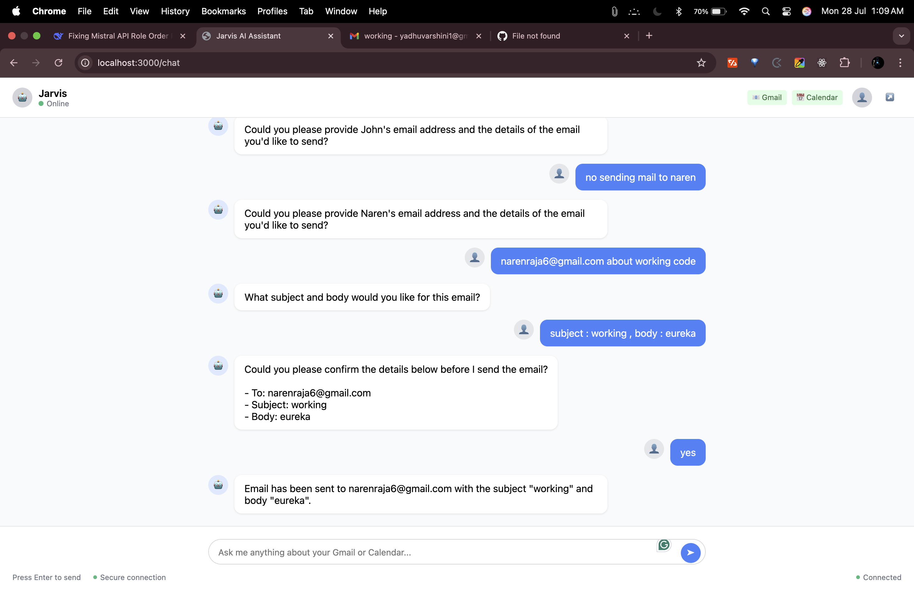

# Jarvis AI Assistant

A simple AI-powered assistant that integrates with Gmail and Google Calendar using natural language conversations. Built as a single-file Express.js application for easy deployment.



## Features

- 📧 Gmail management (read, send, search emails)
- 📅 Google Calendar operations (create, view, update events)
- 🤖 Natural language interface powered by Mistral AI
- 🔐 Secure Google OAuth authentication
- 💬 Clean chat interface with message bubbles
- 🚀 Single-file deployment ready for Vercel/GitHub



## Quick Start

### 1. Clone the Repository

```bash
git clone <your-repo-url>
cd jarvis-ai-assistant
```

### 2. Install Dependencies

```bash
npm install
```

### 3. Environment Setup

Copy the example environment file:

```bash
cp .env.example .env
```

Edit `.env` file with your credentials:

```env
GOOGLE_CLIENT_ID=your_google_client_id_here
GOOGLE_CLIENT_SECRET=your_google_client_secret_here
GOOGLE_REDIRECT_URI=http://localhost:3000/api/auth/callback
MISTRAL_API_KEY=your_mistral_api_key_here
SESSION_SECRET=your_random_session_secret_here
GOOGLE_SETUP_URL=https://console.cloud.google.com/apis/credentials
DATABASE_URL=your_postgres_database_url_here
PORT=3000
```

### 4. Run the Application

```bash
npm start
```

Visit `http://localhost:3000` to see the application.

## Getting API Keys

### Google OAuth Setup (Required)

1. **Go to Google Cloud Console**
   - Visit [Google Cloud Console](https://console.cloud.google.com/apis/credentials)
   - Sign in with your Google account

2. **Create a New Project**
   - Click "Select a project" → "New Project"
   - Enter project name: "Jarvis AI Assistant"
   - Click "Create"

3. **Enable Required APIs**
   - Go to "APIs & Services" → "Library"
   - Search and enable:
     - Gmail API
     - Google Calendar API

4. **Create OAuth 2.0 Credentials**
   - Go to "APIs & Services" → "Credentials"
   - Click "Create Credentials" → "OAuth 2.0 Client IDs"
   - Choose "Web application"
   - Add authorized redirect URIs:
     - `http://localhost:3000/api/auth/callback` (for local development)
     - `https://your-domain.com/api/auth/callback` (for production)

5. **Get Your Credentials**
   - Copy `Client ID` → Add to `GOOGLE_CLIENT_ID`
   - Copy `Client Secret` → Add to `GOOGLE_CLIENT_SECRET`


### Mistral AI API Key (Required)

1. **Sign up for Mistral AI**
   - Visit [Mistral AI Platform](https://console.mistral.ai/)
   - Create an account or sign in

2. **Generate API Key**
   - Go to "API Keys" section
   - Click "Create new secret key"
   - Copy the key → Add to `MISTRAL_API_KEY`


### Database Setup (Optional)

For local development, the app can run with session storage. For production:

1. **Get a PostgreSQL Database**
   - Use [Neon](https://neon.tech/), [Supabase](https://supabase.com/), or [Railway](https://railway.app/)
   - Copy connection string → Add to `DATABASE_URL`

### Session Secret

Generate a random string for session security:

```bash
node -e "console.log(require('crypto').randomBytes(32).toString('hex'))"
```

Copy the output → Add to `SESSION_SECRET`

## Project Structure

```
jarvis-ai-assistant/
├── app.js              # Main application file (backend + frontend)
├── package.json        # Dependencies and scripts
├── vercel.json         # Vercel deployment configuration
├── .env.example        # Environment variables template
├── .gitignore          # Git ignore rules
└── README.md           # This file
```

## Deployment

### Deploy to Vercel

1. **Push to GitHub**
   ```bash
   git add .
   git commit -m "Initial commit"
   git push origin main
   ```

2. **Deploy to Vercel**
   - Visit [Vercel](https://vercel.com/)
   - Click "Import Project" → Select your GitHub repo
   - Add environment variables in Vercel dashboard
   - Update `GOOGLE_REDIRECT_URI` to `https://your-app.vercel.app/api/auth/callback`

3. **Update Google OAuth**
   - Add your Vercel domain to authorized redirect URIs in Google Cloud Console


### Deploy to Other Platforms

The application works on any Node.js hosting platform:

- **Railway**: `railway up`
- **Render**: Connect GitHub repo
- **Heroku**: `git push heroku main`

## Usage Examples

### Gmail Operations

- "Show me unread emails from today"
- "Send an email to john@example.com about the meeting tomorrow"
- "Search for emails from my boss last week"
- "Mark all emails from newsletters as read"

### Calendar Operations

- "What's on my calendar today?"
- "Schedule a meeting with the team tomorrow at 2 PM"
- "Create an event for lunch on Friday at noon"
- "Show me my meetings this week"

### General Queries

- "Summarize my emails from yesterday"
- "Do I have any conflicts in my schedule?"
- "What are my priorities for today?"

## Troubleshooting

### Common Issues

1. **"Failed to initiate sign in"**
   - Check your Google OAuth credentials
   - Verify redirect URI matches exactly

2. **"Not authenticated" errors**
   - Clear browser cookies and try again
   - Check if session secret is set

3. **AI responses not working**
   - Verify Mistral API key is correct
   - Check if you have API credits remaining

4. **Database errors**
   - Ensure DATABASE_URL is correct
   - Check if database is accessible

### Development Tips

- Use `NODE_ENV=development` for detailed error logs
- Check browser developer tools for frontend errors
- Monitor server logs for backend issues

## Security Notes

- Never commit `.env` file to version control
- Use strong session secrets in production
- Keep API keys secure and rotate them regularly
- Enable HTTPS in production

## Contributing

1. Fork the repository
2. Create a feature branch
3. Make your changes
4. Test thoroughly
5. Submit a pull request

## License

GNU License
